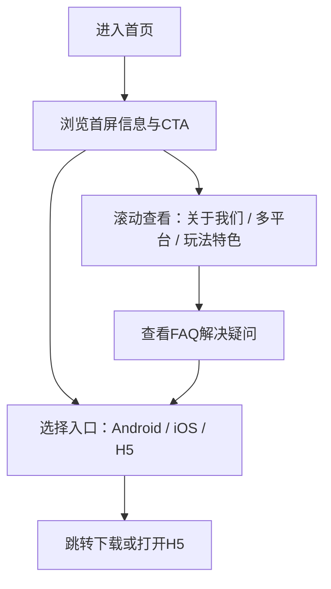

## 1. 产品概述
本项目是一个“企业官网风格”的单页宣传站点，用于展示品牌卖点、产品特色、下载入口与常见问答。
- 面向首次了解产品的用户，提供清晰的价值主张、跨平台下载与快速入口
- 作为SEO与投放落地页，强调可信背书、稳定与公平、安全合规等形象

## 2. 核心功能

### 2.1 功能模块
1. **首页（单页滚动）**：顶部导航、首屏主视觉、CTA按钮（Android/iOS/H5）、二维码区域、背书标识
2. **关于我们**：产品/平台简介、价值与公平性说明、图文搭配
3. **多平台支持**：Windows/iOS/Android/H5等说明与下载入口
4. **玩法/特色展示**：以卡片栅格展示主要玩法与一句话说明，统一“立即体验/立即游玩”按钮
5. **常见问答（FAQ）**：折叠面板形式，覆盖注册、充值、登录、找回密码、昵称、赛事等
6. **页脚**：版权信息、二级导航、联系方式/外链占位

### 2.2 页面详情
| 页面名称 | 模块名称 | 功能描述 |
|---|---|---|
| 首页 | 顶部导航 | 固定吸顶；包含LOGO、锚点链接、移动端菜单；点击滚动到对应区块 |
| 首页 | 首屏主视觉 | 深绿色品牌背景 + 扑克元素装饰；主标题/副标题；CTA按钮（Android/iOS/H5） |
| 首页 | 二维码区 | 展示二维码图与说明文案；支持“下载/联系客服”等按钮（可开关） |
| 首页 | 关于我们 | 图文左右布局；突出“公平公正/安全/隐私/反作弊”等卖点 |
| 首页 | 多平台支持 | 列表或卡片展示平台；强调跨设备体验；每个平台可放下载按钮 |
| 首页 | 玩法/特色 | 8个玩法卡片（德州扑克/奥马哈/极速红包桌/短牌6+/锦标赛/AoF/娱乐场/幸运赛），每个卡片带图标与按钮 |
| 首页 | FAQ | 8条问答；点击展开/收起；支持深链到FAQ区块 |
| 首页 | 页脚 | 版权、站点声明、二级导航；支持“返回顶部” |

## 3. 核心流程
用户进入站点后，快速理解产品价值并完成下载/进入H5体验。

## 4. 用户界面设计

### 4.1 设计风格
- 主色：深绿色（偏墨绿/松柏绿）
- 辅色：金橙色（用于CTA与重点高亮）、少量青绿色用于渐变点缀
- 字体：中文优先选用具有品牌感的黑体/圆体组合（标题更有张力，正文更易读）
- 版式：单页滚动、吸顶导航、模块化分区；玩法使用卡片栅格
- 交互：按钮悬停发光/浮起；模块进入视口时渐入与上移；FAQ折叠动效

### 4.2 页面设计概览
| 页面名称 | 模块名称 | UI要素 |
|---|---|---|
| 首页 | 首屏主视觉 | 大字号标题、扑克元素背景、CTA按钮组、二维码卡片、可信背书标签 |
| 首页 | 关于我们 | 图文分栏、要点列表、装饰分割线与轻量纹理背景 |
| 首页 | 多平台支持 | 平台卡片、图标、辅助说明、下载入口按钮 |
| 首页 | 玩法/特色 | 统一尺寸卡片、玩法图标、短描述、主按钮；支持响应式换行 |
| 首页 | FAQ | 手风琴组件、清晰层级、展开态强调色边框 |
| 首页 | 页脚 | 深色底、导航链接、版权与声明、返回顶部按钮 |

### 4.3 响应式
- 桌面优先：1200px栅格与大留白；首屏视觉突出
- 移动适配：导航折叠菜单；CTA按钮改为纵向堆叠；玩法卡片两列/一列
- 触控优化：按钮高度与间距满足移动端触控；FAQ点击区域扩大

