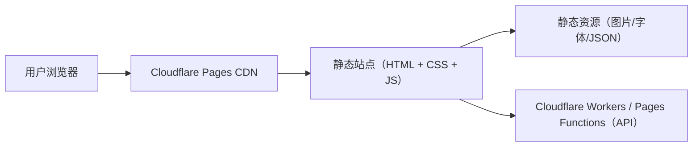

## 1. 架构设计
站点定位为静态宣传站（无构建依赖、无账号体系、无数据库），使用纯 HTML/CSS/JS 输出单页官网；通过 Cloudflare Pages 自动部署静态资源，同时提供 Cloudflare Workers（或 Pages Functions）作为可选API能力（例如联系表单/健康检查/防刷）。



## 2. 技术说明
- 前端：HTML + CSS + 原生 JavaScript（ES2020）
- 样式：自定义CSS（CSS变量 + 响应式栅格 + 动画），不依赖构建工具
- 路由：无（单页锚点滚动：#about、#platforms、#features、#faq）
- 数据：静态配置（本地 JSON / JS 常量），用于玩法列表与FAQ内容
- 部署：Cloudflare Pages（绑定GitHub仓库，push后自动发布；无需构建）
- API：Cloudflare Workers 或 Cloudflare Pages Functions（示例：/api/health、/api/contact）

## 3. 路由定义
| 路由 | 用途 |
|---|---|
| / | 单页宣传站（锚点：#about、#platforms、#features、#faq） |
| /api/health | API健康检查（Workers/Functions） |
| /api/contact | 联系表单提交（Workers/Functions，可先返回示例结果） |

## 4. API 定义（用于Workers/Functions）
联系表单接口（JSON）：
```json
{
  "name": "string",
  "email": "string",
  "message": "string"
}
```
返回：
```json
{
  "ok": true,
  "requestId": "string"
}
```

## 5. 目录与模块建议
- /：静态站点根目录
  - index.html：主页面
  - assets/：图片/字体/图标
  - styles/：全局样式、动画、背景纹理
  - scripts/：交互逻辑（导航、FAQ、滚动动效等）
- functions/：Cloudflare Pages Functions（可选；等价于轻量Workers）
  - api/health.js
  - api/contact.js

## 6. 数据模型（不适用）
本项目无数据库与持久化数据模型；所有展示内容通过静态配置管理。
